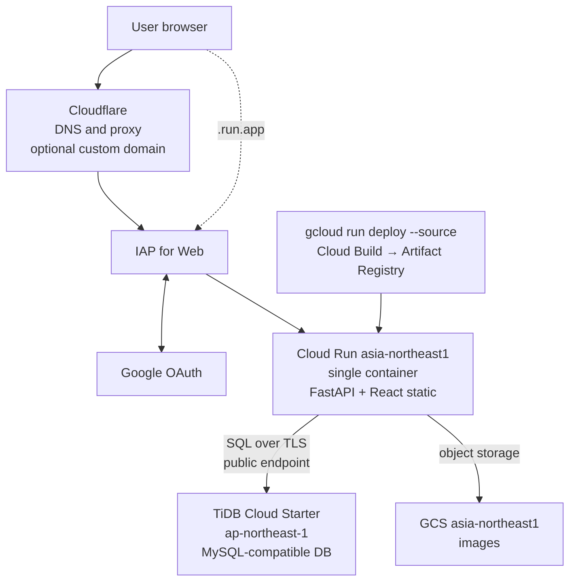

# learnhub-core
comprehensive learning management

## Prerequisites (local)

- Container engine: **Colima** (Mac)
- Local development uses **Docker Compose**

```bash
# If Colima is not running
colima start

# Verify Docker is pointing at Colima
docker context ls
```

## Tech stack

| Layer | Choice |
|---|---|
| Backend | FastAPI (Python **3.14**) |
| Frontend | React + TypeScript (Vite, Node **22**) |
| Local dev | Docker Compose (hot reload) |
| Production | Cloud Run (single container) |

## Infrastructure architecture

Production stack: **Cloud Run + TiDB Cloud Starter + GCS**, with **IAP for Web** for access control. Regions: Cloud Run and GCS in `asia-northeast1` (Tokyo); TiDB Cloud Starter in `ap-northeast-1` (Tokyo).



| Path | Description |
|---|---|
| User → IAP → Cloud Run | All production traffic is authenticated via IAP (allowed Google accounts only) |
| Cloudflare | Optional; custom domain uses Cloud Run domain mapping + Cloudflare proxy (Full strict) |
| TiDB | Cross-cloud (GCP ↔ AWS); no VPC connector required (public endpoint + TLS) |
| GCS | Image blobs; same region as Cloud Run to minimize egress |

## Directory layout

```
learnhub-core/
├── backend/
│   ├── app/
│   │   └── main.py
│   ├── Dockerfile.dev      # local development
│   └── requirements.txt
├── frontend/
│   ├── src/
│   ├── Dockerfile.dev      # local development
│   └── package.json
├── Dockerfile              # Cloud Run (multi-stage, single container)
├── docker-compose.yml      # local dev (hot reload)
├── docker-compose.prod.yml # prod-like single-container check
└── docs/
```

- API routes live under `/api/*`; in development the frontend is at http://localhost:5173 (Vite proxies `/api` to the backend)
- In production, FastAPI serves the React build output at `/`
- Health check: `GET /api/health`

## Local development (default)

```bash
docker compose up --build
```

| URL | Description |
|---|---|
| http://localhost:5173 | Frontend (hot reload) |
| http://localhost:8000/api/health | API direct |

Edits under `backend/app` and `frontend/src` are picked up automatically inside the containers.

Frontend `node_modules` live in a Docker named volume (not on the host).

## Prod-like check (single container)

To run with the same Dockerfile used on Cloud Run:

```bash
docker compose -f docker-compose.prod.yml up --build
```

http://localhost:8080

## Deploy to Cloud Run (example)

Activate the **learnhub-core** gcloud profile, confirm the active project, then deploy with explicit `--project` and `--iap`:

```bash
gcloud config configurations activate learnhub-core

gcloud config get-value project    # expect: learnhub-core-260627
gcloud config get-value run/region # expect: asia-northeast1

gcloud run deploy learnhub-core \
  --project=learnhub-core-260627 \
  --source . \
  --region=asia-northeast1 \
  --port=8080 \
  --no-allow-unauthenticated \
  --iap
```

Use `--no-iap` or `--allow-unauthenticated` only when you intentionally want to disable IAP (e.g. one-time Phase 1 smoke test). For normal production updates, always pass `--iap`. Configure IAP in the console before the first IAP deploy.
